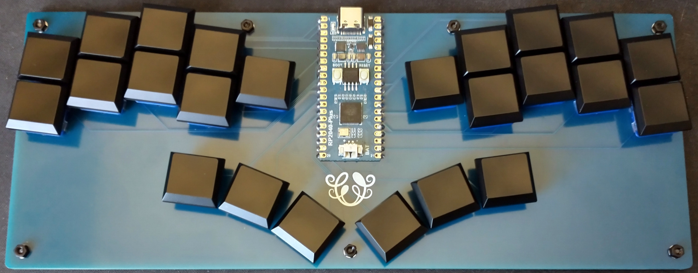
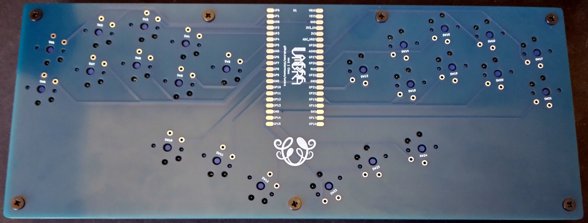
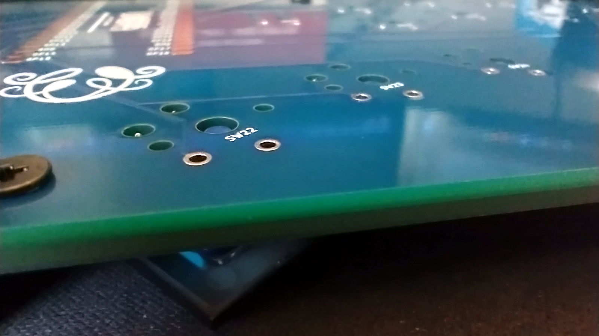
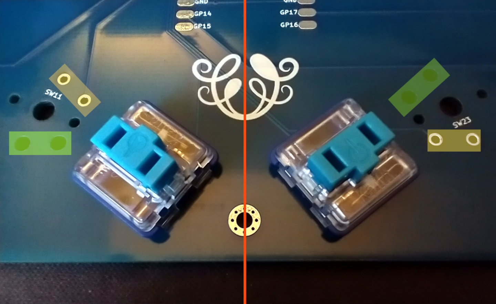

# Umbra Keyboard

Umbra is a 24 key ergonomic keyboard, powered by a Raspberry Pi Pico.

There are enough keys for playing many games with a keyboard. 2D fighting games like Street Fighter was my personal intent for this build.

The board is a simple rectangle for increased sturdiness, which helps when placing the keyboard on your lap.

## Project structure

* [`gerbers`](gerbers): Gerber files for PCB manufacturing
* [`graphics`](graphics): Source assets for PCB silkscreen
* [`kicad`](kicad): KiCad project files (schematics and PCB designs)
* [`kicad-libraries`](kicad-libraries): KiCad components and footprints
* [`images`](images): Images for project documentation
* [`firmware`](firmware): Firmware files

## PCB

The PCB is designed for Kailh Choc v1 keyswitches, and supports keycaps designed for 18mm x 17mm spacing.

The Pi Pico footprint uses surface-mount solder pads. The castellated pads of the Pi Pico are used to solder it directly to the PCB.

The keyswitches are directly connected to the GPIO pins of the Pi Pico.

Each build uses two copies of the same PCB. This PCB acts as both the logical PCB, and when flipped the long way, it acts as a bottom plate to be attached the logical PCB.

## Keyboard firmware

* KMK
    * Setup instructions and basic configuration is in this repo: [`firmware/kmk`](firmware/kmk)
* GP2040-CE
    * Setup instructions in this repo: [`firmware/gp2040-ce`](firmware/gp2040-ce)

## Bill of materials

Vendor URLs are just recommendations based on quality/affordablity. I have purchased from these vendors, but have no personal affiliation with them.

Part | Purpose | Quantity | Notes | Vendor URL
---- | ------- | -------- | --------- | ----------
PCB  | circuit board and bottom plate | 2 | | Send Gerber zip files to [JLCPCB](https://jlcpcb.com/).
Raspberry Pi Pico | Microcontroller board | 1 | Supports other boards with the Pico footprint and castellated solder pads (Waveshare RP2040 Plus) | [Adafruit - Pico without Headers](https://www.adafruit.com/product/4864)
Keyswitches |  | 24 |  | [MKUltra Corporation - Kailh Low Profile Choc Switches](https://mkultra.click/choc-switches)
Keycaps |  | 24 | | [MKUltra Corporation - Kailh Choc Keycaps](https://mkultra.click/kailh-choc-keycaps)
M2 6mm screws | Secure main PCB and bottom plate PCB | 7 | | [AliExpress (wuhushiyu) - 200PCS-M2 Mix - Black](https://www.aliexpress.com/item/32862529967.html)
M2 nuts | Secure main PCB and bottom plate PCB | 7 | | See M2 set above
2mm tall rubber bumpons | Raise board above desk surface and provide skid resitance | 8 | | [Amazon - 3M SJ5302 Clear Bumpon Blister Pack (96 Bumpons)](https://www.amazon.com/SJ5302-Clear-Bumpon-Blister-Bumpons/dp/B01ACPT2LU)

## PCB manufacturing settings

These are the manufacturing settings I used when ordering from JLCPCB:

* **Base Material**: FR4
* **Layers**: 2
* **Dimensions**: (whatever the gerber file specifies)
* **PCB Qty**: 5
* **Different Design**: 1
* **Delivery Format**: Single PCB
* **PCB Thickness**: 1.6
* **PCB Color**: Blue
* **Silkscreen**: White
* **Surface Finish**: LeadFree HASL-RoHS
* **Outer Copper Weight**: 1 oz
* **Gold Fingers**: No
* **Confirm Production File**: No
* **Flying Probe Test**: Fully Test
* **Castellated Holes**: No
* **Remove Order Number**: Specify a location

**IMPORTANT:** The PCB has ["JLCJLCJLCJLC" silkscreen text](https://support.jlcpcb.com/article/28-how-to-remove-order-number-from-your-pcb) on the bottom side of the board. If you want to remove the order number from the boards or you want to print the PCBs with another manufacturer, then I recommend removing this silkscreen text from the `.kicad_pcb` file, and then regenerate the Gerber files.

## Build tips

* Before starting, check if the PCBs are warped, and bend them to be perfectly flat before soldering.
* To secure the bottom plate PCB, you can use flat metal M2 screws instead. Or use double-sided tape to adhere the bottom plate PCB directly to the logical PCB.

## KiCad project notes

The keyswitch footprints have cutouts for their through-hole solder pads, rotated 180 degrees from the center of the footprint. On opposite halves of the PCB, the keyswitch footprints are rotated 180 degrees. This allows the cutouts to encase the solder pads when the PCB is flipped and used as a bottom plate.

This project contains KiCad footprints for both Choc and MX switches with these mounting cutouts. There are also footprints and symbols for other microcontroller boards with castellated pads considered for the design (Waveshare RP-2040 Zero and Seeed XIAO RP2040).

Here are guidelines for using Umbra's self-encasing PCB construction approach for your own designs:

* Choose a microcontroller board which has castellated pads. Place the microcontroller footprint at the exact center of the PCB.
    * If the microcontroller board has components soldered to its bottom side (e.g., the Waveshare RP2040 Zero), then make a cutout on the PCB in the space between the solder pads of the microcontroller board's footprint.
* Place keyswitches on the left and right sides of the board so they are perfectly symmetric with each other. On the right side of the board, rotate each keyswitch 180 degrees.
* Make the board's edge cuts perfectly symmetric the long way. Rectangles are cool, but so are curvy shapes that trace the contours of the keyswitches!

## Revision history

* Choc rev1 (2022-03-19)
    * Initial PCB design